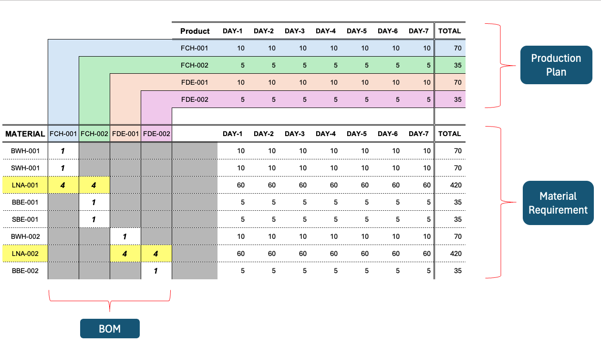
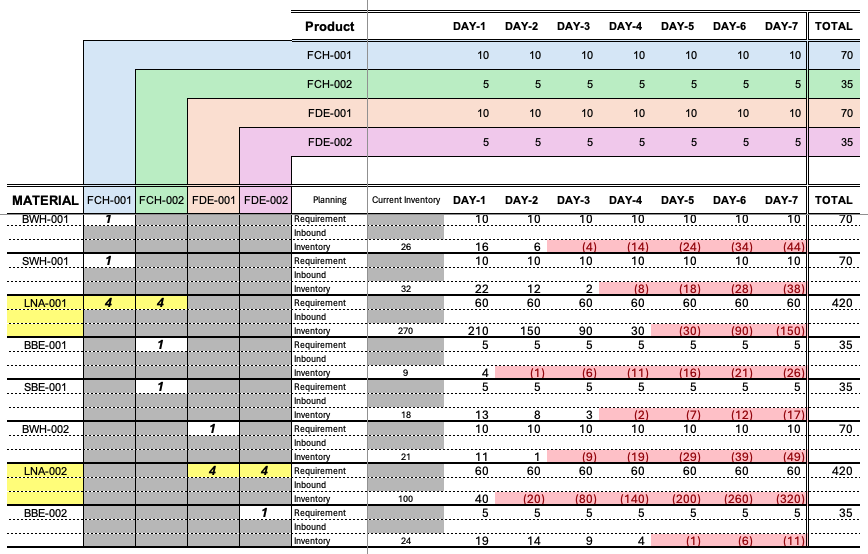

# How to operate anmMRP

---

## 1. Rigister your product(s) in anmMRP

    a. PROD NUM
    b. Name
    c. Description
    d. Selling Price

- ### EXAMPLE in a furniture company sells 3 types of chairs and 3 types of desks

  | PROD NUM | NAME             | DESCRIPTION                  | PRICE |
  | -------- | ---------------- | ---------------------------- | ----: |
  | FCH-001  | Chair Gen 1.0-WH | White Chair with wooden legs |   $50 |
  | FCH-002  | Chair Gen 1.0-BE | Beige Chair with wooden legs |   $50 |
  | FCH-003  | Chair Gen 1.0-BL | Black Chair with wooden legs |   $50 |
  | FDE-001  | DESK Gen 1.0-WH  | White DESK with wooden legs  |  $100 |
  | FDE-002  | DESK Gen 1.0-BE  | Beige DESK with wooden legs  |  $100 |
  | FDE-003  | DESK Gen 1.0-BL  | Black DESK with wooden legs  |  $100 |

## 2. Rigister BOM item(s) & characteristics for each product

    a. PART#  - assigned part number per your own part number policy
    b. NANE - name of each item (ex. Tire, Bolt 2mm, etc.)
    c. DESCRIPTION - added description to for other users/readers
    d. QTY. - quantity needed to build 1 product
    e. UOM - unit of measure, such as pcs., kg., once, lb, etc.
    e. Supplier name - the material provider
    f. PRICE - price for you to pay for purchasing the item
    g. LEADTIME - Delivery lead time from supplier to your site (from placing order to arriving at your door)
    h. MOQ. - minimum order quantity. It could be 1 or if one packaginging contains 12 units, then your minimum order quantity becomes 12.

- ### _BOM for FCH-001 Chair Gen 1.0-WH_

  | PART Num. | NAME               | DESCRIPTION                         | QTY. | UOM | SUPPLIER    | PRICE | LEADTIME | MOQ |
  | --------- | ------------------ | ----------------------------------- | ---: | --- | ----------- | ----: | -------: | --: |
  | BWH-001   | White Back Plate   | Back part of chair, **white** color |    1 | pc  | Plasticlove |   $10 |  10 days |  25 |
  | SWH-001   | White bottom Plate | Sit part of chair, **white** color  |    1 | pc  | Plasticlove |   $10 |  10 days |  25 |
  | LNA-001   | MID Wooden Leg     | General Wooden Leg for Chair        |    4 | pc  | Woodlove    |  $2.5 |  10 days | 100 |

- ### _BOM for FCH-002 Chair Gen 1.0-BE_

  | PART Num. | NAME               | DESCRIPTION                         | QTY. | UOM | SUPPLIER    | PRICE | LEADTIME | MOQ |
  | --------- | ------------------ | ----------------------------------- | ---: | --- | ----------- | ----: | -------: | --: |
  | BBE-001   | Beige Back Plate   | Back part of chair, **beige** color |    1 | pc  | Plasticlove |   $10 |  10 days |  25 |
  | SBE-001   | Beige bottom Plate | Sit part of chair, **beige** color  |    1 | pc  | Plasticlove |   $10 |  10 days |  25 |
  | LNA-001   | MID Wooden Leg     | General Wooden Leg for Chair        |    4 | pc  | Woodlove    |  $2.5 |  10 days | 100 |

- ### _BOM for FDE-001 Desk Gen 1.0-WH_

  | PART Num. | NAME             | DESCRIPTION                    | QTY. | UOM | SUPPLIER    | PRICE | LEADTIME | MOQ |
  | --------- | ---------------- | ------------------------------ | ---: | --- | ----------- | ----: | -------: | --: |
  | BWH-002   | White Desk Board | Board of desk, **white** color |    1 | pc  | Plasticlove |   $20 |  10 days |  25 |
  | LNA-002   | LONG Wooden Leg  | General Wooden Leg for desk    |    4 | pc  | Woodlove    |  $2.5 |  10 days | 100 |

- ### _BOM for FDE-002 Desk Gen 1.0-BE_
  | PART Num. | NAME             | DESCRIPTION                    | QTY. | UOM | SUPPLIER    | PRICE | LEADTIME | MOQ |
  | --------- | ---------------- | ------------------------------ | ---: | --- | ----------- | ----: | -------: | --: |
  | BBE-002   | Beige Desk Board | Board of desk, **beige** color |    1 | pc  | Plasticlove |   $20 |  10 days |  25 |
  | LNA-002   | LONG Wooden Leg  | General Wooden Leg for desk    |    4 | pc  | Woodlove    |  $2.5 |  10 days | 100 |

## 4. Input production plan by product into anmMRP

    a. Review your demand forecast & build production plan
    b. Don't have demand forecast? make one based on your past selling record & your best judgement :)
    c. Demand plan needs to be built to match the time horizon & time slot of your production plan.
    b. Make steady state production input plan in a way to
        i. supply the demand without shortages
        ii. maintain the minimum inventory of product
        iii. maintain fixed time schedule per day in your facility
    c. Once production plan is complete, input the plan into anmMRP.

- ## Demand Forecast

  | Product | DAY-1 | DAY-2 | DAY-3 | DAY-4 | DAY-5 | DAY-6 | DAY-7 | TOTAL |
  | ------- | :---: | :---: | :---: | :---: | :---: | :---: | :---: | :---: |
  | FCH-001 |   0   |  20   |   0   |  20   |   0   |  20   |   0   |  60   |
  | FCH-002 |   0   |   0   |  15   |   0   |   0   |  15   |   0   |  30   |
  | FDE-001 |  10   |   5   |  10   |   5   |  10   |   5   |  10   |  55   |
  | FDE-002 |   0   |   0   |  15   |   0   |   0   |   5   |  15   |  35   |

- ## Production Plan _(Steady State Schedule)_
  | Product | DAY-1 | DAY-2 | DAY-3 | DAY-4 | DAY-5 | DAY-6 | DAY-7 | TOTAL |
  | ------- | :---: | :---: | :---: | :---: | :---: | :---: | :---: | :---: |
  | FCH-001 |  10   |  10   |  10   |  10   |  10   |  10   |  10   |  70   |
  | FCH-002 |   5   |   5   |   5   |   5   |   5   |   5   |   5   |  35   |
  | FDE-001 |  10   |  10   |  10   |  10   |  10   |  10   |  10   |  70   |
  | FDE-002 |   5   |   5   |   5   |   5   |   5   |   5   |   5   |  35   |

## 5. Review Material Requirement per your production plan

    a. You can see the list of BOM items & required quantities by the timeline of your production plan
    b. input the current inventory of each item at "Current inventory" (you can leave blank if there is none")
    c. The current inventory makes the "Days on hand" data, which enables material status monitoring againt the lead time of each material.

## 6. Review inventory shortage forecast with exploded view at MRP

    a. Once your production plan & BOM registration is complete, now you can review the inventory projection thru the planning horizon.
    b. Each item shows negative inventory as the production consumes all of the current inventory, and the level of negativeness increases.
    c. Instantly, you can see BBE-001 & LNA-002 will cause material shortages in Day-2 per current production plan

